<picture>
  <source media="(prefers-color-scheme: dark)"  srcset="dark.svg">
  <source media="(prefers-color-scheme: light)" srcset="light.svg">
  
</picture>

  

# Hi, I'm Shyamsundar Sharma 👋

### AI/ML Engineer · Data Scientist · Python Developer

---

## About Me

B.Tech CSE (AI/ML) student at Vivekananda Global University · CGPA **8.73/10** (rising every semester)

Running **3 concurrent internships** in ML, Deep Learning, and Data Analytics.
I build end-to-end ML systems — from raw data to deployed models.

- 🎯 **95%+ recall** on fraud detection with <1% class imbalance
- 🌾 **~87% accuracy** on crop/fertilizer recommendation
- ⚡ **~35% faster** data processing · **~50% faster** model training

---

## Tech Stack

---

## Featured Projects

### 🌾 [AI for Farmers — Crop & Fertilizer Recommendation](https://github.com/Shyamsundar2203/ai-for-farmers)
> Python · Scikit-learn · Flask · Weather API · NLP · HTML/CSS

- **~87% model accuracy** on crop/fertilizer prediction from soil + live weather data
- Real-time Weather API for location-aware recommendations
- Local-language NLP chatbot for rural accessibility

---

### 💳 [Credit Card Fraud Detection](https://github.com/Shyamsundar2203/fraud-detection)
> Python · Scikit-learn · Pandas · SMOTE · Imbalanced Learning

- **95%+ recall** handling extreme <1% class imbalance via SMOTE
- Threshold tuning to minimise false positives in production
- Full EDA pipeline with feature engineering

---

### 🧘 [Study Tracker & Meditation Suggestion App](https://github.com/Shyamsundar2203/study-tracker-ai)
> Python · Flask · NLP · SQLite · Chart.js · JavaScript

- Analyses **10+ behavioural metrics** via real-time dashboard
- Bilingual (English/Hindi) mood-based NLP chatbot
- SQLite persistence + REST backend

---

## Experience

| Role | Company | Duration |
|------|---------|----------|
| 🤖 AI/ML Intern | UptoSkills *(Remote)* | May 2026 – Present |
| 📊 Data Analytics Intern | DigiSamaksh Pvt. Ltd. *(Remote)* | Jun 2026 – Present |
| 🤖 AI/ML Intern | Labmentix Pvt. Ltd. *(ISO 9001:2015)* 🏅 LoR | Jun 2025 – Dec 2025 |

---

## GitHub Stats

&nbsp;

---

## Contribution Graph

<picture>
  <source media="(prefers-color-scheme: dark)"
          srcset="https://raw.githubusercontent.com/Shyamsundar2203/Shyamsundar2203/output/github-snake-dark.svg">
  <source media="(prefers-color-scheme: light)"
          srcset="https://raw.githubusercontent.com/Shyamsundar2203/Shyamsundar2203/output/github-snake.svg">
  
</picture>

---

## Certifications

`IBM` Machine Learning with Python &nbsp;·&nbsp;
`IBM` Python for Data Science & AI &nbsp;·&nbsp;
`IBM` AI For Everyone &nbsp;·&nbsp;
`IBM` Cybersecurity Tools &nbsp;·&nbsp;
`Simplilearn` Data Science Foundation

---

📍 Jaipur, Rajasthan, India &nbsp;·&nbsp; B.Tech CSE (AI/ML) 2023–2027

**Open to AI/ML Engineer and Data Scientist roles — feel free to reach out.**

